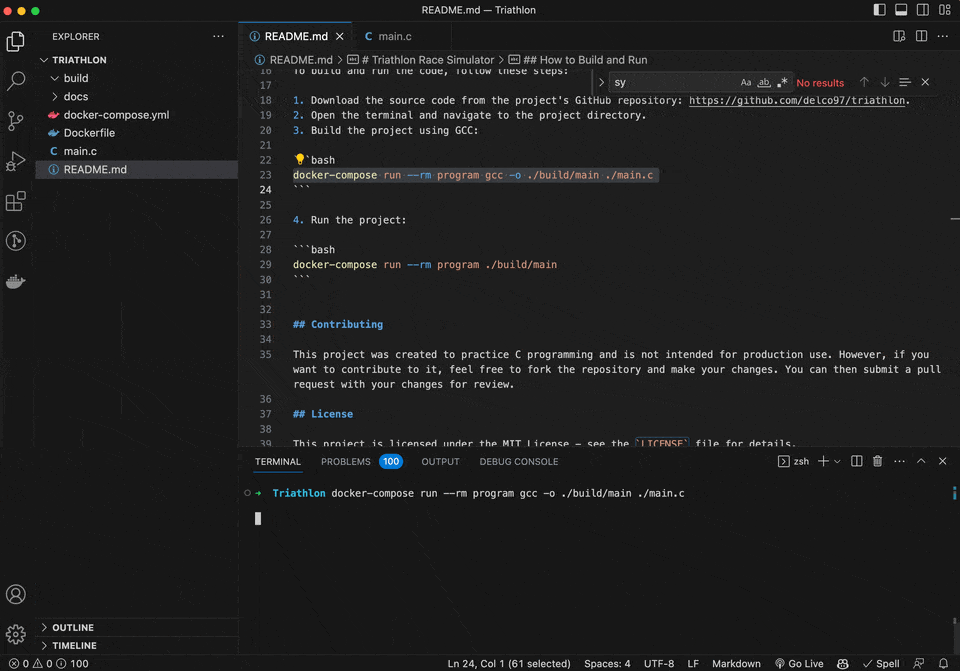

# Triathlon Race Simulator



This project is a C program that simulates a triathlon race. The program allows users to enter participants, allocate points, and print the classification to a file. Competitors can earn a score ranging from 10 points (1st place) to 1 point (last place).

## Requirements

To build and run the code, you will need to have the following software installed:

- Docker: Download and install Docker from the official website https://www.docker.com/get-started.
- Docker Compose: Download and install Docker Compose from the official website https://docs.docker.com/compose/install/.

## How to Build and Run

To build and run the code, follow these steps:

1. Download the source code from the project's GitHub repository: https://github.com/delco97/triathlon.
2. Open the terminal and navigate to the project directory.
3. Build the project using GCC:

```bash
docker-compose run --rm program gcc -o ./build/main ./main.c
```

4. Run the project:

```bash
docker-compose run --rm program ./build/main
```


## Contributing

This project was created to practice C programming and is not intended for production use. However, if you want to contribute to it, feel free to fork the repository and make your changes. You can then submit a pull request with your changes for review.

## License

This project is licensed under the MIT License - see the `LICENSE` file for details.